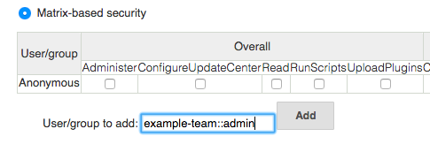

Jenkins Bitbucket OAuth Plugin
============================

Overview
--------
This Jenkins plugin enables [OAuth](https://oauth.net) authentication for [Bitbucket](https://bitbucket.org) users.

Bitbucket Security Realm (authentication):
--------------------------------------------

First you need to get consumer key/secret from Bitbucket.

1. Log into your Bitbucket account.
2. Open your workspace and click the gear icon on the right top corner, select "Workspace settings" to open workspace settings.
3. Select **OAuth consumers** under **Apps and features**.
4. Click **Add consumer**.
5. The system requests the following information:
   * **Name** is required.
   * **Callback URL** is required. Input **https://your.jenkins.root/securityRealm/finishLogin**.
   * Others are optional.
6. Select **Account > Read** under **Permissions**.
7. Click Save.
The system generates a key and a secret for you.
Toggle the consumer name to see the generated Key and Secret value for your consumer.

Second, you need to configure your Jenkins.

1. Open Jenkins **Manage Jenkins** page and open **System** page.
2. Set correct URL to **Jenkins URL**
3. Click **Save** button.
4. Open Jenkins **Security** page.
5. Select **Bitbucket OAuth Plugin** in **Security Realm**.
6. Input your Consumer Key to **Client ID**.
7. Input your Consumer Secret to **Client Secret**.
8. Click **Save** button.

### Bitbucket Team access Support
Based on the teams that user has access to, this plugin automatically creates groups of the form

_team::role_

Supported roles are:
* `administrator`
* `owner` (deprecated / for backward compatibility)
* `member`
* `collaborator` (deprecated / for backward compatibility)

Examples
```
team1::administrator
team2::member
```

These group names can be used in Jenkins *Matrix-based security* to give fine grained access control based on the users team access in Bitbucket.




Via Groovy script
-----------------------------------
```groovy
import hudson.security.AuthorizationStrategy
import hudson.security.SecurityRealm
import jenkins.model.Jenkins
import org.jenkinsci.plugins.BitbucketSecurityRealm
import hudson.util.Secret

// parameters
def bitbucketSecurityRealmParameters = [
  clientID:     '012345678901234567',
  clientSecret: '012345678901234567012345678901'
]

// security realm configuration
SecurityRealm bitbucketSecurityRealm = new BitbucketSecurityRealm(
  bitbucketSecurityRealmParameters.clientID,
  "",
  Secret.fromString(bitbucketSecurityRealmParameters.clientSecret)
)

// authorization strategy - full control when logged in
AuthorizationStrategy authorizationStrategy = new hudson.security.FullControlOnceLoggedInAuthorizationStrategy()

// authorization strategy - set anonymous read to false
authorizationStrategy.setAllowAnonymousRead(false)

// get Jenkins instance
Jenkins jenkins = Jenkins.getInstance()

// add configurations to Jenkins
jenkins.setSecurityRealm(bitbucketSecurityRealm)
jenkins.setAuthorizationStrategy(authorizationStrategy)

// save current Jenkins state to disk
jenkins.save()
```

Changelog
-------
[CHANGELOG](CHANGELOG)

Credits
-------
This plugin reuses many codes of [Jenkins Assembla Auth Plugin](https://wiki.jenkins-ci.org/display/JENKINS/Assembla+Auth+Plugin).
Many thanks to Assembla team.
